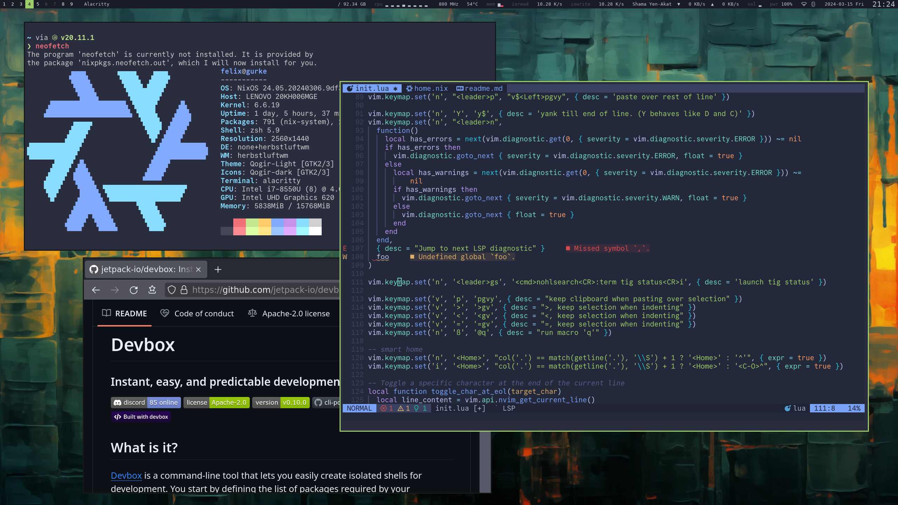
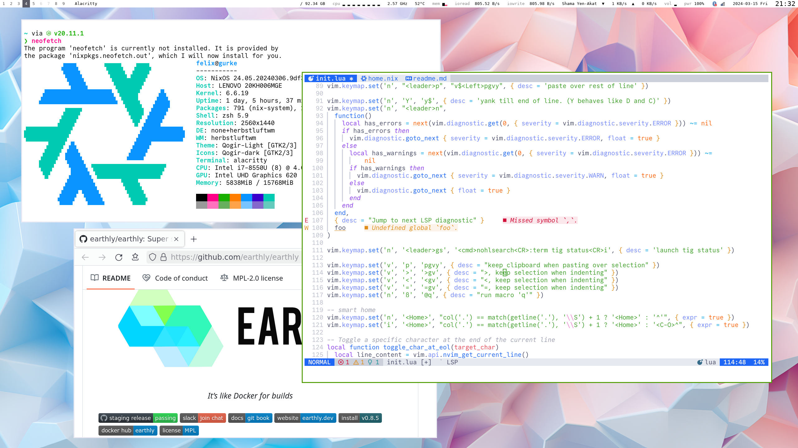

# How I use my computer




- Linux Distribution: [NixOS](https://nixos.org/) ([with flakes](https://nixos-and-flakes.thiscute.world/nixos-with-flakes/nixos-with-flakes-enabled))
- Dotfiles: normal Git repository + [Home Manager](https://nix-community.github.io/home-manager/index.xhtml)
- Shell: [ZSH](https://zsh.sourceforge.io/) (via Home Manager)
- Editor: [Neovim](https://neovim.io/) + [LazyVim](https://www.lazyvim.org) (I always use it in the terminal or with [neovide](https://neovide.dev))
- Keyboard layout: [Neo Layout](https://neo-layout.org/)

- Tiling Window Manager: [Herbstluftwm](https://herbstluftwm.org/)
- Statusbar: [Polybar](https://github.com/polybar/polybar)
- Terminal: [Alacritty](https://github.com/alacritty/alacritty)
- Font: [Commit Mono](https://commitmono.com/)
- Theme: [tokyonight-storm](https://github.com/folke/tokyonight.nvim) (dark) / [catppuccin-latte](https://github.com/catppuccin/catppuccin) with white background (light)

- Password Manager: [KeePassXC](https://keepassxc.org/) synced with [MEGA](https://mega.nz/) to cloud + android, with [Syncthing](https://syncthing.net/) to trusted friends - covers:
  - SSH Agent
  - TOTP Authenticator
  - [secret service / gnome-keyring](https://c3pb.de/blog/keepassxc-secrets-service.html)
  - secret lookups for environment variables, like `OPENAI_API_KEY`
- Screenshot tool: [Flameshot](https://flameshot.org/)
- git TUI: [tig](https://jonas.github.io/tig/) - make precise commits by staging individual git hunks instead of whole files

## My Installation

**WARNING**: These are the installation instructions for myself, not for you. You should have your own repository and get inspired by this one. If you have any questions, feel free to open issues.

All paths assume a running NixOS or nix-enabled system with flakes.

```bash
curl -sSfL https://artifacts.nixos.org/nix-installer | sh -s -- install --enable-flakes
# or
curl --proto '=https' --tlsv1.2 -L https://nixos.org/nix/install | sh -s -- --daemon
```


### A — Quick shell on any box (standalone Home Manager)

No clone needed; points straight at the GitHub flake. Ephemeral or permanent — brings my zsh, neovim, git and CLI tools.

```bash
nix run home-manager -- switch -b backup \
  --flake github:fdietze/dotfiles#felix@x86_64-linux
# aarch64 machines: use #felix@aarch64-linux
```

### B / C — Full NixOS host (defined host or brand-new machine)

One bootstrap script handles both. It clones the repo, then asks whether to set up the whole system (NixOS + Home Manager) or just the Home Manager shell profile. For a hostname that is already defined (e.g. `gurke`) it builds that host directly; for a new machine it derives a desktop-free host from `hosts/template/`, generates `hardware-configuration.nix`, and offers to rebuild.

```bash
bash <(curl -fsSL https://raw.githubusercontent.com/fdietze/dotfiles/master/scripts/setup-new-host.sh)
```

If `curl` is missing on a minimal install: `nix-shell -p curl`.

To keep a new host long-term, promote it: add desktops and a `local.nix` the way `hosts/gurke/` does.

# Awesome Links

- What are `.zshrc` / `.zshenv` / `.zprofile`? <https://unix.stackexchange.com/questions/71253/what-should-shouldnt-go-in-zshenv-zshrc-zlogin-zprofile-zlogout>
- Better bash functions: <https://cuddly-octo-palm-tree.com/posts/2021-10-31-better-bash-functions/>

# Notes

- managing dotfiles with a normal git repo and Home Manager-owned links
- fzf over dotfiles: vd
- Neo keyboard layout
- Vim and keybindings
- toggle ; at end of line
- quickly edit dotfiles with vim: vv
- fzf for editing dotfiles
- git alias: g
- zsh bell after every command
- v for fzf+vim in current git repo
- Tiling Window Manager keybindings
- NixOS
- Dark and Light color scheme switching
- Tools
- tig
- fzf
- redshift
- unclutter
- zeal

- Scala
- reverse compilation errors

# Best practices

- put lots of links to issues/docs as comments everywhere. Open them from vim with `gx`.
