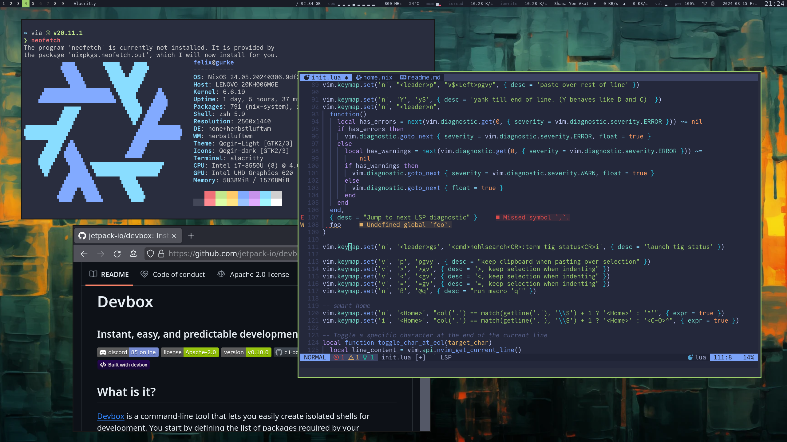
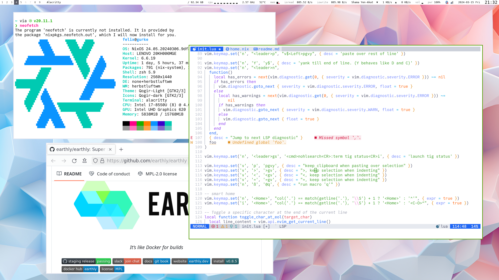

# How I use my computer




- Linux Distribution: [NixOS](https://nixos.org/) ([with flakes](https://nixos-and-flakes.thiscute.world/nixos-with-flakes/nixos-with-flakes-enabled))
- Dotfiles: [bare git](https://www.atlassian.com/git/tutorials/dotfiles) + [Home Manager](https://nix-community.github.io/home-manager/index.xhtml)
- Shell: [ZSH](https://zsh.sourceforge.io/) (via Home Manager)
- Editor: [Neovim](https://neovim.io/) + [lua config](https://lsp-zero.netlify.app/v3.x/tutorial.html) (I always use it in the terminal)
- Keyboard layout: [Neo Layout](https://neo-layout.org/)

- Tiling Window Manager: [Herbstluftwm](https://herbstluftwm.org/)
- Statusbar: [Polybar](https://github.com/polybar/polybar)
- Terminal: [Alacritty](https://github.com/alacritty/alacritty)
- Font: [Commit Mono](https://commitmono.com/)
- Theme: [tokyonight-storm](https://github.com/folke/tokyonight.nvim) (dark) / [catppuccin-latte](https://github.com/catppuccin/catppuccin) with white background (light)

- Password Manager: [KeePassXC](https://keepassxc.org/) synced with [MEGA](https://mega.nz/) to cloud + android, with [Syncthing](https://syncthing.net/) to trusted friends  - covers:
  - SSH Agent
  - TOTP Authenticator
  - [secret service / gnome-keyring](https://c3pb.de/blog/keepassxc-secrets-service.html)
  - scecret environment variables, like `OPENAI_API_KEY`
- Screenshot tool: [Flameshot](https://flameshot.org/)
- git TUI: [tig](https://jonas.github.io/tig/) - make precise commits by staging individual git hunks instead of whole files

## My Installation
**WARNING**: These are the installation instructions for myself, not for you. You should have your own repository and get inspired by this one. If you have any questions, feel free to open issues.
```bash
# Manage dotfiles entirely with git:
git clone --bare git@github.com:fdietze/dotfiles.git "$HOME/dotfiles.git"
alias dt='GIT_DIR="$HOME/dotfiles.git" GIT_WORK_TREE="$HOME" git -c status.showUntrackedFiles=no'
dt checkout master

ssh-keygen -t ed25519
```

# Awesome Links

* What are `.zshrc` / `.zshenv` / `.zprofile`? https://unix.stackexchange.com/questions/71253/what-should-shouldnt-go-in-zshenv-zshrc-zlogin-zprofile-zlogout
* Better bash functions: https://cuddly-octo-palm-tree.com/posts/2021-10-31-better-bash-functions/

# Notes

* managing dotfiles with pure git + external worktree in $HOME
* fzf over dotfiles: vd
* Neo keyboard layout
* Vim and keybindings
 * toggle ; at end of line
* quickly edit dotfiles with vim: vv
* fzf for editing dotfiles
* git alias: g
* zsh bell after every command
* v for fzf+vim in current git repo
* Tiling Window Manager keybindings
* NixOS
* Dark and Light color scheme switching
* Tools
 * tig
 * fzf
 * redshift
 * unclutter
 * zeal

* Scala
 * reverse compilation errors

